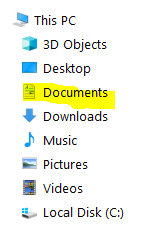
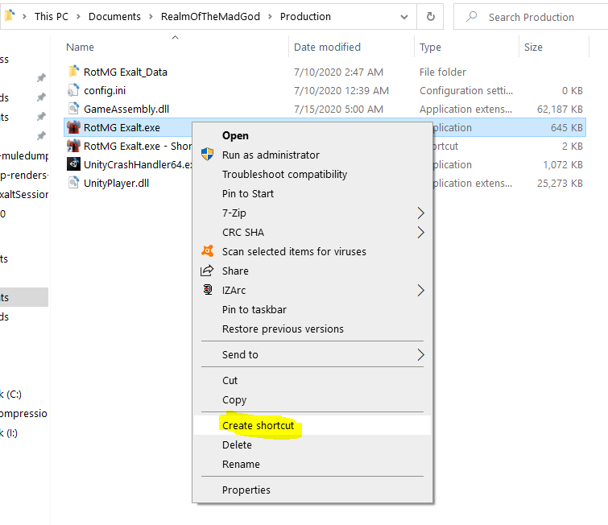
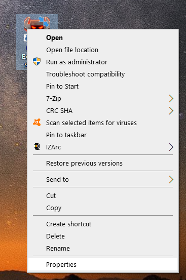
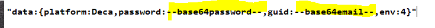
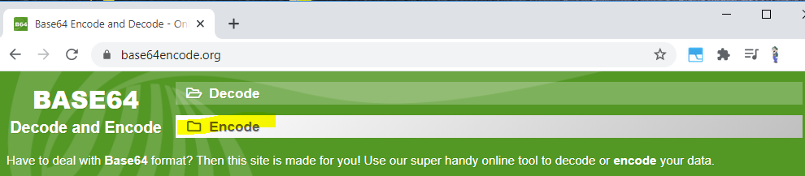
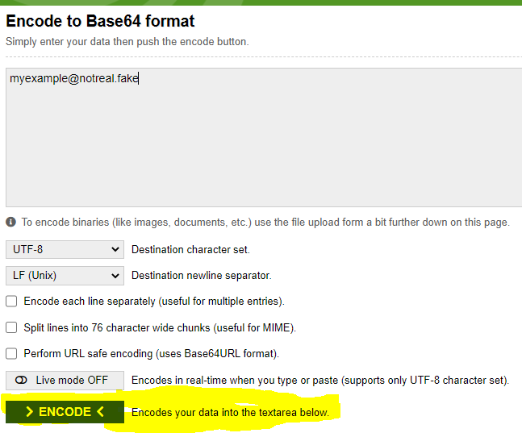
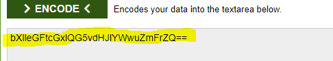
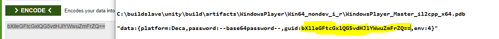
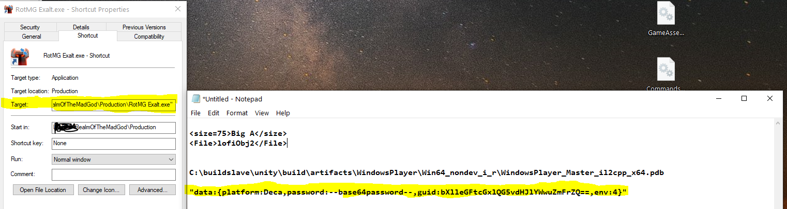

# realm_alts

Here's a quick guide on how to have multiple instances of exalt running

The game's main executable is located in the documents folder.  For reference, the launcher can be found in program files.

You will find this ROTMG folder in your "Documents" / "My Documents" directory.  We will enter the "Production" folder inside of it.

   

___

   

Create a new shortcut.  We will drag it to our desktop.

___

   

Right click on the shortcut which is now on our desktop, and click "properties", which is the last selection.

___

   

Copy and paste the following test into a notepad or other word document:

"data:{platform:Deca,password:--base64password--,guid:--base64email--,env:4}"

We will take the username and password for the specific account we want this shortcut to sign us into the game for.  Yes, we have to make a shortcut for each individual account you want to launch simultaneously.  The --base64....-- parts will be replaced with our unique account info.

NEVER SHARE the following information with anyone, as it is literally your account sign in information.  Anyone with this information will be able to sign onto your account, so please be careful.  Don't give it to anyone you wouldn't give your literal password.

___

   

Visit this website, and select the encode option at the top to begin.  Any other similar utility will work fine, this was just the first one I happened to find.

___

   

Obviously this is not my real email address, but you will need to put your real account info here, so it can be converted into the base64 format the game expects to see.  

Simply type it in then click encode.

___

   

Here is what I received.  Your result will also end with two equal sign characters "==".  

This is what we are going to copy and paste into the text we already put into a word document earlier.

___

   

As you can see, I deleted the placeholder text from before, and inserted exactly what we just encoded our email into.

I do not show the steps for password.  They are exactly the same, and you need to only replace your email at the top of the page with your password, and encode it in the same fashion.

___

   

Once you have the complete login information exalt needs to start the game, we can put that info directly into our shortcut.

Return to the properties window of the shortcut we already opened.  Go to the end of the target line, and add one space.  Now, copy and paste the entire highlighted text from your notepad, as you can see in my example, even the quotation marks must be included for this to work.

Now simply click okay at the bottom of the properties window!  You are all done!

This shortcut directly runs the game, and totally circumvents the launcher having to curtail the game starting.  Not only that, you can create shortcuts for as many accounts as you want, and they can all run together simultaneously.

This guide was for all of the players who keep claiming that we can only have a single instance of exalt running at once.
